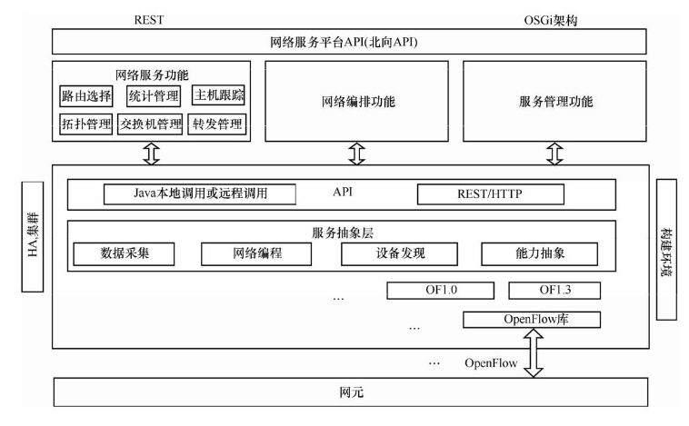
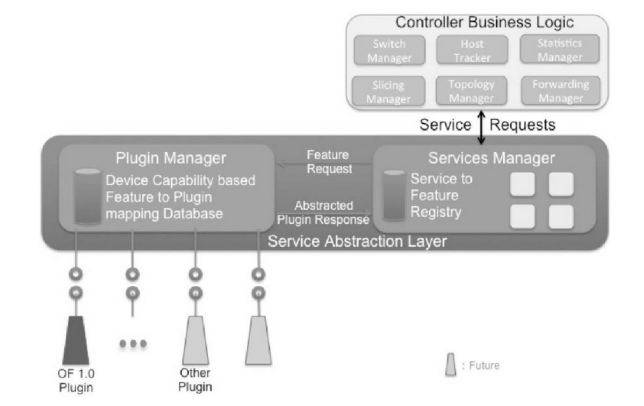
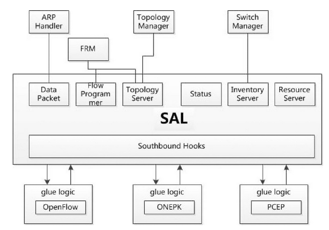

## 一、ODL控制器简介

Controller 在 OpenDaily 众多项目中属于底层框架项目，它提供消息总线、业务抽象、拓扑管理、设备管理以及插件配置等基础功能。Controller是基于OSGi的插件系统。因此，它可以运行在任何支持Java的操作系统或平台上。并且可以方便地添加、删除、修改插件。

随着项目的发展，产生的OSGi Bundle越来越多，因此，OpenDayLight在Helium中开始采用Apache Karaf作为运行容器，加强对Bundle的管理，使插件的安装和管理更加方便和快捷。

Controller 在北向接口提供了丰富的RESTful接口，可以基于北向接口做应用而不需开发OpenDayLight内部插件，这让基于OpenDayLight的开发有多种方式。

## 二、基础框架

Controller 通过封装和插件的方式，将各个组件或者插件组合起来，形成完整的SDN Controller项目，其基本框架如图：

  

## 三、服务抽象层

服务抽象层SAL是OpenDayLight项目中核心的组成部分，向动态链接到其上面的系统模块提供服务，南向提供服务以支持多种南向协议，北向提供服务以支持其他模块和应用的功能，使得控制器能支持多种南向协议，并为模块和应用提供多种服务，SAL的架构如下：

  

### 1、SAL提供的服务

  

- 拓扑服务（Topology Service）：一系列服务的集合，允许传递拓扑信息，如发现一个新节点、新链路等。
- 数据包服务（Data Packet Service）：将任何代理发送的数据包发送至应用。
- 流编程服务（Flow Programming Service）：向不同的代理提供编程必须遵守的逻辑——匹配/操作（Match/Action）规则。
- 统计规则（Statistics Service）：提供搜集统计信息的API，包括：
   - 流
   - 节点连接器（端口）
   - 队列
- 库存服务（Inventory Service）：提供如返回结点和结点连接器这类库存信息的API。
- 资源服务（Resource Service）：查询资源状态的点位符。
