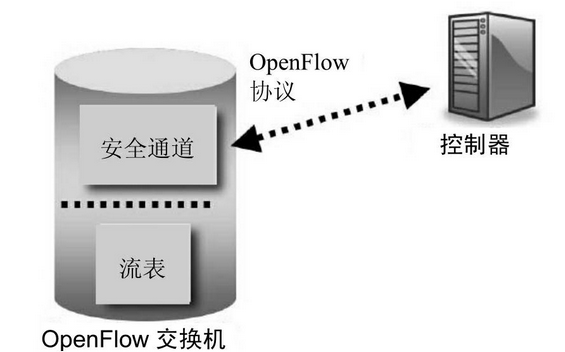
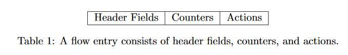
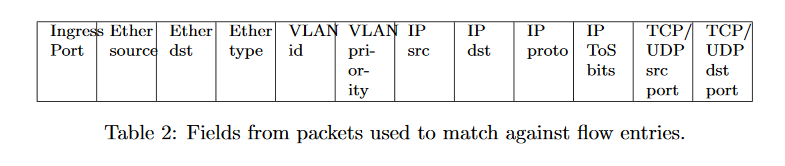
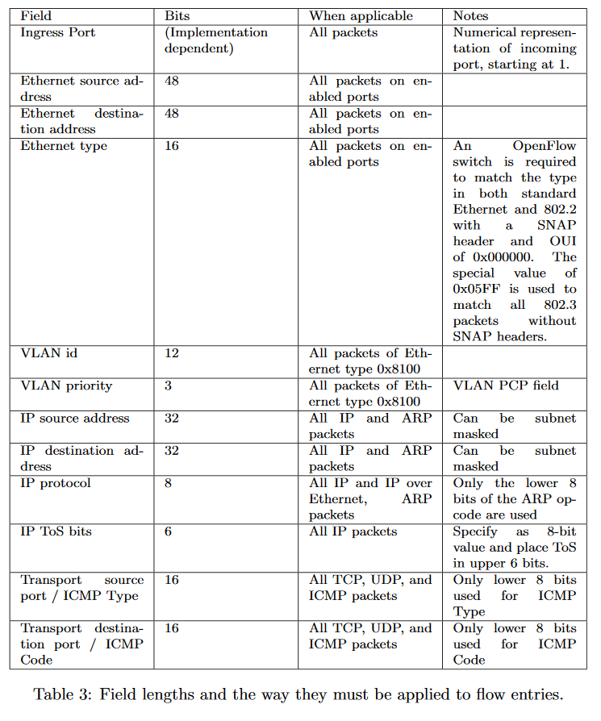
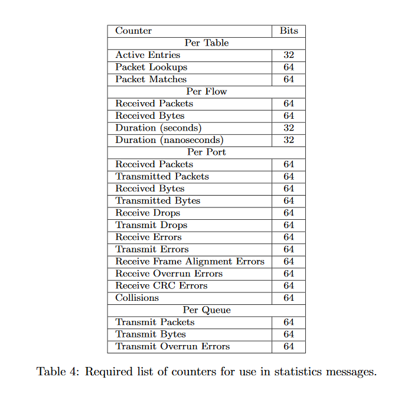

一个支持OpenFlow 1.0 的交换机有一张流表和一个安全通道，流表向交换机提供数据包的查找和转发工作的依据，安全通道向交换机提供到外部控制器的安全连接，如下图所示。控制器使用OpenFlow 1.0 这一南向协议对交换机进行控制。

  

## 一、OpenFlow 流表

OpenFlow 通过部署流表来指导数据平面流量。OpenFlow 1.0 中每台OpenFlow交换机只有一张流表，这张流表中存储这许多的表项，每一个表项都表征了一个流及其对应的处理方法——动作(Action)表，一个数据分组进入OpenFlow交换机后需要先匹配流表，若符合其中某条表项的特征，则按照相应的动作进行转发，否则封装为 `Packet-in` 消息通过安全通道交给控制器，由控制器决定如何处理。另外，每条流表项都存在一个有效期，过期之后会自动删除。

## 二、流表项的结构

OpenFLow 的流表项主要由3个部分组成，分别是用于数据分组匹配的分组头域（Head Field）、用于保存和条目相关统计信息的计数器（Counter）、匹配表项后需要对数据分组执行的动作表（Action）。

  

### 1、分组头域

分组头域是数据分组匹配流表项时参考的依据，在OpenFlow 1.0中，分组头域包括了12个字段。

  

每个元组有其对应的使用场景，数值的长度不尽相同，可以是一个确定的值，也可以为ANY以匹配任意值，其中IP地址还可以指定子网掩码以便完成更为精确的匹配。需要指出的是，入端口（Ingress Port）不属于2~4层的概念，它是数据分组进入Openflow交换机的物理端口的标识，可看作数据分组在一层的标识。

  

### 2、计数器

流表中的计数器用来统计相关流的一些信息，例如查找次数，收发分组数、生存时间等。另外，Openflow针对每张表、每个端口、每个队列也会维护它们相对应的计数器。

  

### 3、动作表

动作表指定了OpenFlow交换机处理相应流的行为。动作表可以包含0个或多个动作，交换机会按照这些动作的先后顺序依次执行。动作可分为必选动作和可选动作。必选动作是默认支持的，而交换机需要通知控制器它支持的可选动作。另外，当流表项中存在OpenFlow交换机不支持的动作时，将向控制器返回错误信息。

**必选动作**

- **转发**：交换机必须支持将数据分组转发给设备的物理端口及下面的虚拟端口。

   - **ALL**：数据分组复制为多份转发到所有端口（不包含入口，不考虑最小生成树）。
   - **CONTROLLER**：将数据分组封装为Packet-in消息并转发给控制器。
   - **LOCAL**：转发给本地网络栈。
   - **TABLE**：将控制器Packet-out数据分组执行流表的匹配。
   - **IN_PORT**:将数据分组从它的入端口发出去。
- **丢弃**：没有明确指明处理行动的表项，所匹配的所有数据分组默认被丢弃。

**可选动作**

- **转发**

   - **NORMAL**：按照OpenFLow交换机所支持的传统交换机的二层或三层策略进行转发。
   - **FLOOD**：通过最小生成树从出口泛洪发出，但不包括入口。
- **入队**：将数据分组转发到某个端口上已经配置好的队列中，队列的配置OpenFLow无法实现。
- **修改域**:交换机将修改数据分组的分组头，可以为12元组的任意字段

## 三、OpenFlow协议消息

### 1、控制器-交换机消息

这类消息由控制器发起，包括Feature、Configuration、Modify-State、Read-State、Send-Packet、Barrier等几类消息，用于对OpenFow交换机的管理。控制器通过其中各种请求消息来查询OpenFlow交换机的状态，OpenFlow交换机收到后需回复相应的响应消息。

**（1）Featue**

安全通道建立以后，控制器立即发送Feature-Request消息给交换机以获得它支持的特性。

**（2）Configuration**

控制器可以通过 `Set-Config` 消息设置或通过 `Get-Config` 消息查询交换机上的配置消息，交换机需要通过 `Config-Reply` 消息做出应答。

**（3）Modify-State**

控制器通过 `Port-mod` 消息来管理端口状态，通过 `Flow-Mod` 消息增删交换机的流表项，

**（4）Read-State**

在流表结构中讲到OpenFlow针对每张表、每个流表项、每个端口、每个队列都会维护它们相应的计数器，当控制器需要统计信息时，会向交换机发送相应的Request消息以进行信息的请求。

**（5）Send-Packet**

很多情况下，控制器需要发送分组到数据平面，这时可以通过 Packet-out 消息封装好数据分组传给Openflow交换机，并在该消息中指定特定的动作表指导交换机处理这个数据分组，而不再进行流表的匹配（除非动作表中包含转发到Table的动作）。这种消息往往作为控制器对Packet-in消息处理逻辑的一部分，若希望封装的数据字段独立于相应的Packet-in消息，需要指定 buffer-id 字段为-1，并给出明确的数据字段值。

**（6）Barrier**

控制器通过 Barrier-Request消息确保之前下发的一些消息已经被交换机执行完毕。它就像一个屏障一样，当交换机收到这个消息后立即处理完在其之前收到的所有消息，并回复Barrier-Reply，之后再处理在其之后收到的消息。

### 2、异步消息

这类消息用来将网络时间或交换机状态的变化更新到控制器。也就是说，这类消息的触发不是由于控制器的请求，而是由交换机主动发起的，控制器也不知道交换机什么时候会发送这类消息。因为SDN是集中式管控的架构，当交换机不知道怎么处理流量，或者它的状态发生了改变又或者发生了一些异常的时候，OpenFlow交换机就会通过这类消息将相应情况上报给控制器，由控制器完成决策。这类消息主要包括以下4种子类型。

**（1）Packet-in**

收到的数据包如果在流表种没有匹配项，或者匹配的流表项种给出了转发动作中指定的端口为 CONTROLLER 的动作时，OpenFlow交换机会封装 `Packet-in`消息把这个数据分组上交给控制器。封装时，如果交换机本地的缓存足够，数据分组将被临时放在缓存中，它分组头中的控制信息（默认128 B）和在交换机缓存中的序号（Buffer-id）一同发给控制器，控制器通过这个字段通过`Packet-out` 消息处理缓存中的数据分组；如果交换机不支持本地缓存，或缓存容量不足，则将整个数据分组封装进 `Packet-in` 消息发给控制器。

**（2）Flow-Removed**

交换机中的流表项因为超时或修改等原因被删除时，会触发 `Flow-Removed` 消息,前提是这条流表项在下发时 flags 字段置位了 `OFPFF_SEND_FLOW_REM`。

**（3）Port-Status**

交换机端口状态发生变化时（例如UP/Down），会触发`Port-Status`消息报告端口的信息以及发生的状态变化（增加、删除或修改）

**（4）Error**

交换机通过Error消息来通知控制器发生的错误信息。

### 3、对称消息

与前两种消息不同的是，对称类的消息可由控制器或者OpenFLow交换机中的任意一侧发起，这类消息包括以下3种类型。

**（1）Hello**

认证通过后，双方通过握手消息Hello建立安全通道。

**（2）Echo**

双方均可以主动向对方发出`Echo-Request`消息，接收者需要回复Reply。该消息用来保活，也可以测量延迟。

**（3）vendor**

为未来的协议版本预留，以允许OpenFlow交换机厂商提供额外的OpenFlow功能。

## 参考

[OpenFlow Switch Specification](https://www.opennetworking.org/wp-content/uploads/2013/04/openflow-spec-v1.0.0.pdf)
