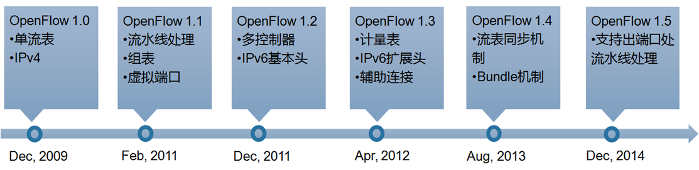
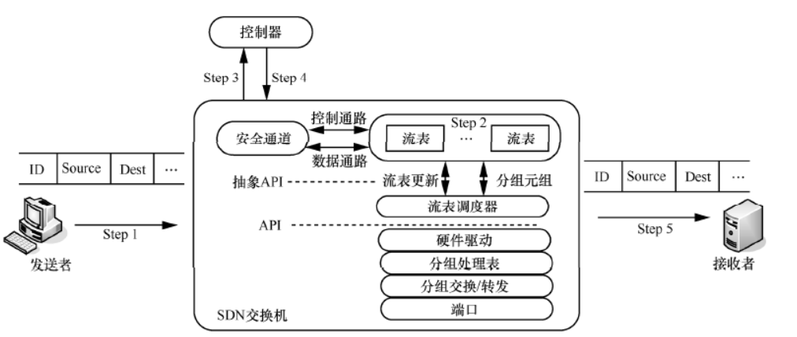
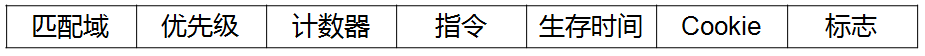
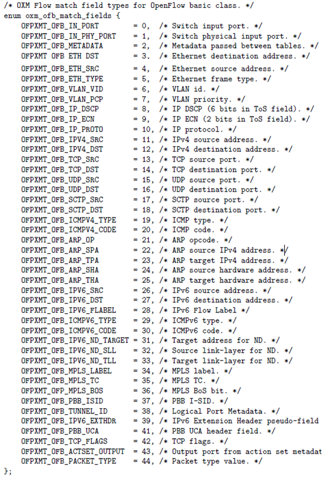
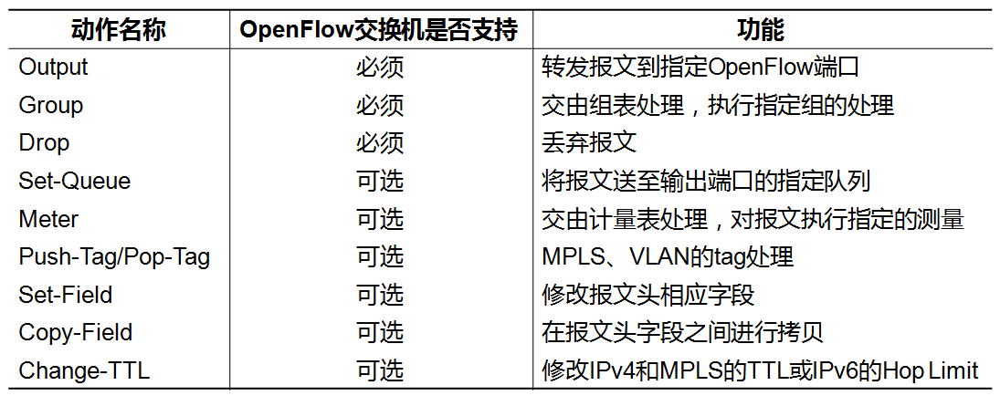
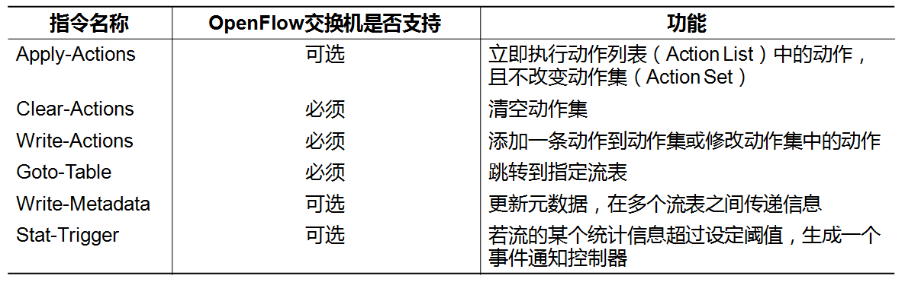
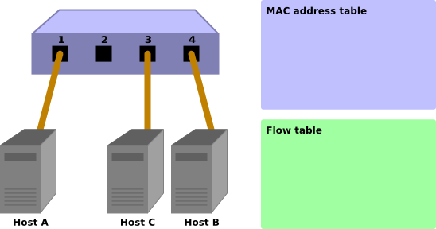
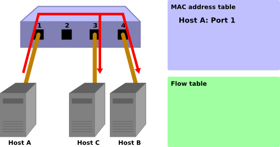
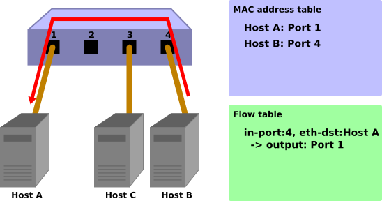
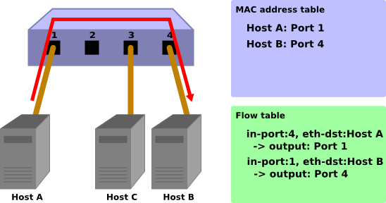

## 一、前言

本文主要参考OpenFlow v1.5.1协议、v1.3.0协议以及SDN相关书籍，对OpenFlow中主要机制（如流表与流水线处理、组表、计量表等）的原理进行解析。

## 二、OpenFlow 简介

### 1、OpenFlow 发展史

OpenFlow由斯坦福大学Nick  Mckeown教授提出，为SDN控制平面与数据平面之间提供通信接口标准，以实现SDN网络的转控分离架构。OpenFlow协议允许SDN控制器直接访问和操作数据平面中的网络设备，控制网络转发行为，数据平面采用基于流的方式进行转发。目前由ONF（Open Networking Foundation）负责推广和制定OpenFlow标准，截至本文发表时，最新版本为1.5.1。

  

### 2、SDN与OpenFlow的关系

​	可以说OpenFlow是SDN中非常重要的技术，以至于许多人（包括笔者在内）在谈及SDN时就自然联想到OpenFlow。但SDN与OpenFlow不是划等号的关系，而是SDN包含OpenFlow的关系。实际上，SDN有多种实现方案，在ONF SDN方案中OpenFlow充当南向接口的作用。

​	南向接口的定义是控制平面与数据平面之间进行交互的协议，南向接口除了可以采用OpenFlow外，还有许多别的协议，如OF-CONFIG、OVSDB、NETCONF、PCEP、XMPP等等。

## 三、基于OpenFlow的SDN工作原理

  

- Step1：发送者连接到网络并向SDN 交换机传输相应数据分组。
- Step2：SDN 交换机接收数据分组并解析分组头后，在自身流表中查询该数据分组有无对应流规则。如果匹配成功，则直接转发至相应端口；如果匹配失败，则进行下一步骤。
- Step3：SDN 交换机根据相应数据分组产生Packet-in 事件，以TCP 协议或TLS 协议（安全传输层协议）将`Pakcet-in` 数据分组发送至控制器。
- Step4：SDN 控制器接收`Packet-in` 数据分组后，根据相关应用产生相应转发策略，并下发至相应SDN 交换机。
- Step5：SDN交换机将流规则加入流表，并将相应数据分组转发至指定接口，从而完成数据转发。

## 四、流表与流水线处理

### 1、流

在介绍流表之前，需要先解释流的概念，流（Flow）就是具有相同特征的数据包集合。例如，源MAC地址为MAC_A，目的MAC地址为MAC_B的所有数据包集合就可以视为一条流，可见流具有方向性。有别于传统网络中路由器基于数据包独立转发的模式，使用OpenFlow的SDN网络是基于流进行转发的，即对相同特征的数据包集合采用同样的处理。

### 2、流表

流表（Flow  Table）是OpenFlow中最重要的一张表，它用于指导OpenFlow交换机对收到的数据包进行转发，相当于二层的MAC地址表和三层的路由表。在OpenFlow 1.1以后的版本中，每台交换机支持使用多张流表，构成流水线处理，从而完成对数据包更为复杂的处理。

流表由若干条流表项（Flow Entry）组成，流表项结构如下图所示。

  

- 匹配域（Match Fields）：用于定义某条流，也是流表匹配的依据
- 指令（Instructions）：表示对该条流应该如何处理
- 优先级（Priority）：表示该流表项的优先匹配程度
- 计数器（Counters）：用于统计该条流的信息
- 生存时间（Timeouts）：表示流表项的有效存活时间
- Cookie：控制器设置用来过滤被流统计、流修改和流删除操作请求影响的流表项
- 标志（Flags）：用于流表项管理

流表项最为重要的两项为匹配域和指令，当OpenFlow交换机收到一个数据包，将它包头解析后与流表中流表项匹配域进行匹配，匹配成功则执行指令，因此流表可以简化理解为key-value形式的{匹配域-指令}表。

**匹配域**

OpenFlow提供丰富的匹配域字段来定义不同粒度的流，如可以基于目的IP地址定义一条流，也可以根据源IP地址 + 目的IP地址来定义一条流。

  

**指令与动作**

指令（Instruction）是流表项匹配成功时的处理动作，分为三类

- 更新动作集（Action Set）：添加、修改、清空动作集，前面两个对应Write-Actions指令，清空动作集对应Clear-Actions指令
- 修改流水线处理次序：从序号低的表跳转到序号高的表，对应Go-To-Table指令
- 其他：更新元数据以及设定触发器，分别对应Write-Metadata指令和Stat-Trigger指令

  

**动作（Action）**

Action是指对数据包的具体处理动作，可分为两类，一类是定义数据包的转发，另一类是修改数据包包头字段。

  

### 1、OpenFlow 交换机

OpenFlow 交換器接受來自于 controller 的指令可以执行以下操作。

- 对于接收到的数据包進行修改或針對指定的端口進行转发。
- 对于接收到的数据包進行转发到 Controller 的動作（ `Packet-In` ）。
- 对于接收到來自 Controller 的数据包转发到指定的端口（ `Packet-Out` ）。

Controller 使用 `Packet-In` 接收來自交換器的数据包之後進行分析，得到并记录端口相关資料以及所連接的 host 的 MAC 地址。然后，對所收到的数据包進行转发。将数据包的目的地址，在已經學習的 host 資料中進行檢索，根據檢索的結果會進行下列處理。

- 如果是已經存在記錄中的 host：使用 `Packet-Out` 功能转发至先前所對應的端口
- 如果是尚未存在記錄中的 host：使用 `Packet-Out` 功能來实现 Flooding

下面将一步一步的說明並附上圖片以幫助理解。

### 初始狀態

Flow table 為空白的狀況。将 host A 接到端口 1，host B 接到端口 4，host C 接到端口 3。

  

### host A → host B

當 host A 向 host B 發送数据包。這時後會觸發 Packet-In 訊息。host A 的 MAC 地址与端口 1 被記錄下來。由於 host B 的 MAC 地址尚未被學習，因此會進行 Flooding 並将数据包往 host B 和 host C 發送。

  

Packet-In:

```
in-port: 1
eth-dst: host B
eth-src: host A
```

Packet-Out:

```
action: OUTPUT: Flooding
```

### host B → host A

数据包從 host B 向 host A 返回時，在 Flow table 中新增一筆 Flow Entry，並将数据包转发到端口 1。 因此該数据包並不會被 host C 收到。

  

Packet-In:

```
in-port: 4
eth-dst: host A
eth-src: host B
```

Packet-Out:

```
action: OUTPUT: port 1
```

### host A → host B

再一次， host A 向 host B 發送数据包，在 Flow table 中新增一個 Flow Entry 接著转发数据包到端口4。

  

Packet-In:

```
in-port: 1
eth-dst: host B
eth-src: host A
```

Packet-Out:

```
action: OUTPUT: port 4
```

接下來，讓我們實際來看一下在 Ryu 當中實作交換器的原始碼。

## 参考

+ [Ryubook](https://book.ryu-sdn.org/zh_tw/html/switching_hub.html)
