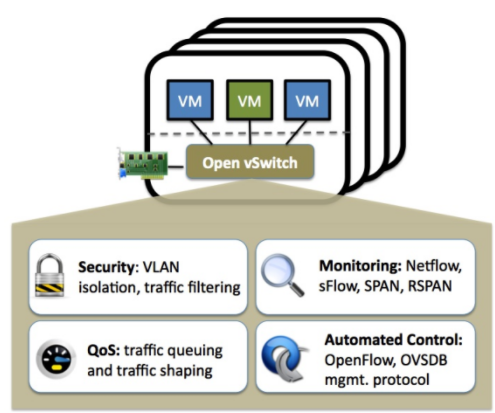
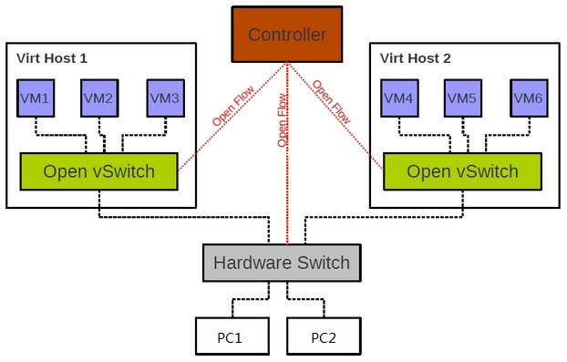
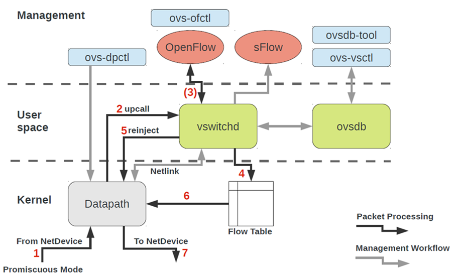
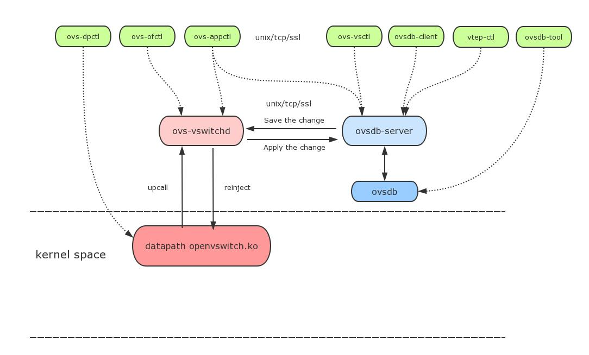
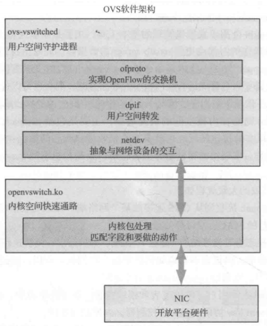
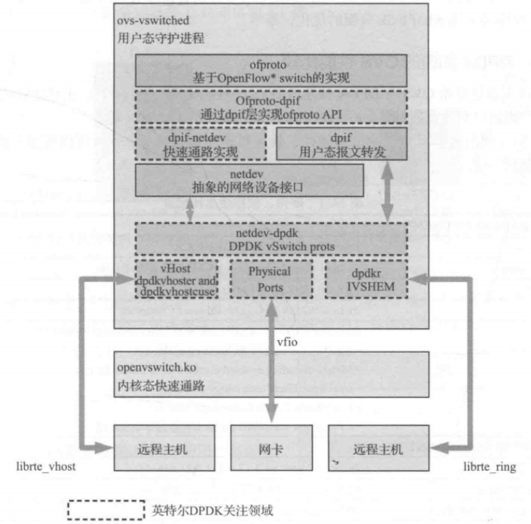

Open vSwitch是在开源的Apache2.0许可下的产品级质量的多层虚拟交换标准！它旨在通过编程扩展，使庞大的网络自动化（配置、管理、维护），同时还支持标准的管理接口和协议。

  

## 一、OVS 的角色

在SDN的架构下，ovs作为 SDN交换机，向上连接控制器，向下连接主机。并且Open vSwitch交换机是能够与真是物理交换机通信，相互交流数据。

  

## 二、OVS 架构

架构图1：

  

---

架构图2：

  

从整体上看，OVS 架构分为内核空间、用户空间、配置管理层3个部分。

### 1、OVS 内核空间（包含 Datapath 和流表）

- Datapath：主要负责实际的数据分组处理，它同时与 ovs-vswitchd 和流表保持关联，使 OVS 上层可以对数据分组处理进行控制。
- 流表中存储着分组处理的依据——流表项，它知道Datapath做出正确的分组处理判断，同时还与ovs-vswitchd上下关联，是OVS上层对底层分组处理过程进行管理的接口。

### 2、OVS 用户空间（包含 ovs-vswitchd 和 ovsdb）

- **ovs-vswitchd**:ovs守护进程，负责检索和更新数据库信息，并根据数据库中的配置信息维护和管理OVS。
- **ovsdb-server**：VS轻量级的数据库服务器的服务程序，直接管理ovsdb，与ovsdb通信进行数据库的增删改查操作。同时负责向vswitchd提供操作ovsdb的能力。
- **ovs-db**:开放虚拟交换机数据库是一种轻量级的数据库，用于管理OVS的配置信息，主要负责保存OVS配置信息和数据流信息等。它是一个JSON文件，默认路径:/etc/openvswitch/conf.db;

### 3、OVS 管理工具

- **ovs-vsctl**:查询与配置OVS数据库的实用工具，用于查询或者变更vswitchd的配置信息，该工具会直接更新ovsdb数据库。
- **ovs-dpctl**:管理OVS Datapath的实用工具，用来配置vswitch内核模块，控制数据分组的转发规则。用户使用该工具可以创建、修改和删除Datapath。
- **ovs-appctl**：发送命令消息到ovs-vswithchd, 查看不同模块状态。
- **ovs-ofctl**：Openflow交换机的命令行管理工具，用于管理与配置OVS作为OpenFLow交换机时的各种参数。用户使用该工具时可以查询或修改OpenFlow交换机的专改、配置和流表项等信息。

### 4、OVS 中数据分组的转发机制

作为数据转发设备，OVS的最主要功能是数据分组处理，它对数据分组的处理过程视情况可分为以下两个步骤：

- 第一步是由内核空间的 `Datapath` 尝试直接对数据分组进行转发操作
- 第二部是由内核空间和用户空间的协同工作进行分组处理。

举例，当数据分组到达OVS后，首先将数据分组头信息与OVS内核空间中流表的表项进行匹配，查找与之对应的表项。如果查找到匹配的表项则根据表项中的规定进行分组处理，如果流表中没有匹配项，则需要由用户空间完成整个分组处理过程。

### 5、内部模块及其关联关系

**OVS数据通路的内部模块**

  

**基于DPDK加速的OpenvSwitch的软件架构**

  
